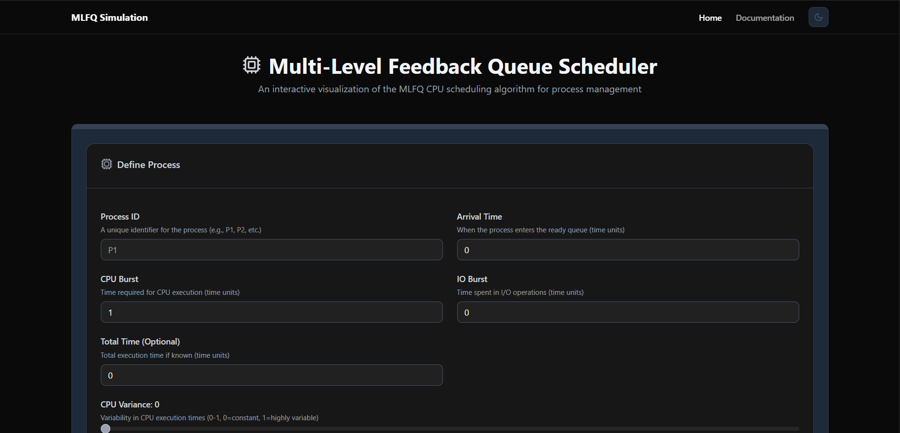

Berikut adalah versi yang lebih terstruktur, profesional, dan menarik dari README GitHub untuk proyek frontend **MLFQ Simulation** kamu:

---

# ⚙️ MLFQ Simulation Frontend

A **modern web application** for visualizing and simulating the **Multi-Level Feedback Queue (MLFQ)** CPU scheduling algorithm. Built for interactivity, clarity, and learning.



---

## 📌 Overview

This repository contains the **frontend** codebase for the MLFQ Simulation project. It offers an interactive, educational tool to explore and experiment with the MLFQ CPU scheduling algorithm — ideal for students, educators, or developers who want to visualize process scheduling in action.

---

## ✨ Features

* 🎛️ **Interactive Process Creation**
  Add and configure processes with custom parameters like arrival time, burst time, priority, etc.

* 📊 **Real-time Visualization**
  Watch the scheduling algorithm unfold dynamically with animated feedback.

* 🕒 **Gantt Chart Display**
  Visual timeline to see when and how each process is executed.

* ⚙️ **Algorithm Configuration**
  Customize queue settings: time quantum, number of queues, aging settings, etc.

* 🌙 **Light & Dark Mode**
  Toggle between themes for better readability and comfort.

* 📱 **Responsive UI**
  Fully optimized for both desktop and mobile devices.

---

## 🧰 Tech Stack

### 🖥️ Frontend

* **Framework**: [Next.js](https://nextjs.org/)
* **Language**: TypeScript
* **Styling**: TailwindCSS
* **UI Components**: Shadcn UI
* **Animations**: Framer Motion
* **Form Handling**: React Hook Form + Zod

### 🔗 Backend Integration

This frontend connects to a backend built with:

* Python
* FastAPI
* Pydantic
* Uvicorn

> 🔗 Make sure your backend is up and running before using the frontend.

---

## 🚀 Getting Started

### ✅ Prerequisites

* Node.js **v18.x** or later
* `npm` or `yarn`

### 🔧 Installation

1. **Clone the repository**

   ```bash
   git clone https://github.com/your-username/mlfq-simulation-frontend.git
   cd mlfq-simulation-frontend
   ```

2. **Install dependencies**

   ```bash
   npm install
   # or
   yarn install
   ```

3. **Setup environment variables**

   Create a `.env.local` file and add your backend URL:

   ```env
   NEXT_PUBLIC_API_URL=http://localhost:8000
   ```

4. **Run development server**

   ```bash
   npm run dev
   # or
   yarn dev
   ```

5. Open [http://localhost:3000](http://localhost:3000) in your browser.

---

## 🧪 Usage Guide

1. Navigate to the home page.
2. Create new processes with different characteristics.
3. Configure algorithm settings.
4. Run the simulation.
5. Watch real-time updates and Gantt chart rendering.
6. View final statistics and export results.

---

## 📖 Documentation

Find more information in the in-app documentation or check the following:

* [How to Use](#)
* [How It Works](#)
* [Tools & Technologies](#)
* [Project Structure](#)
* [Backend Integration](#)

---

## 🔌 Backend Requirement

This frontend relies on a running instance of the **MLFQ Simulation Backend**.
Please ensure the backend is set up and accessible at the URL defined in `.env.local`.

👉 [Backend Repository](#)

---

## 🤝 Contributing

We welcome contributions from the community! To contribute:

1. Fork this repository
2. Create a new branch:

   ```bash
   git checkout -b feature/your-feature-name
   ```
3. Make your changes
4. Commit your work:

   ```bash
   git commit -m "Add your feature"
   ```
5. Push to GitHub:

   ```bash
   git push origin feature/your-feature-name
   ```
6. Open a **Pull Request**

Please ensure:

* Code follows the existing style.
* Components are tested if applicable.

---

## 📄 License

This project is licensed under the [MIT License](./LICENSE).

---

## 📬 Contact

If you have any questions, suggestions, or feedback:

* Open an [issue](https://github.com/your-username/mlfq-simulation-frontend/issues)
* Or reach out via the **Contact** page in the app

---

